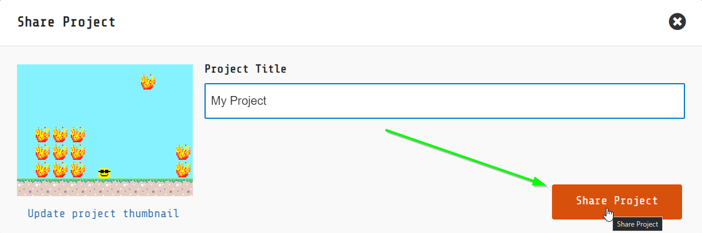
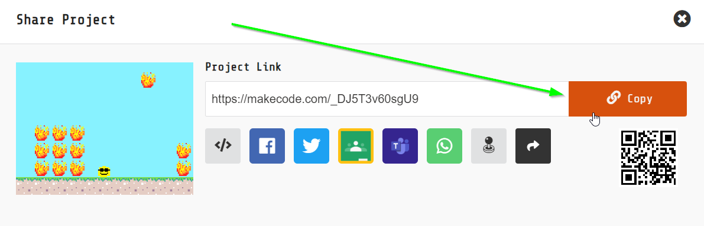

## Saving and Sharing
When you have a game you would like to share, follow these steps:

1. Click the share button in the upper right:  
    
1. Enter a name for the project (change it from "Untitled" to something else), and click the "Share Project" button:  
    
1. Click the "Copy" button to copy the link:  
    
1. [Click here to open up the submission form](https://forms.gle/ZdoCahpNkxZEKMva6)
1. Enter your name, paste the link, and submit!
